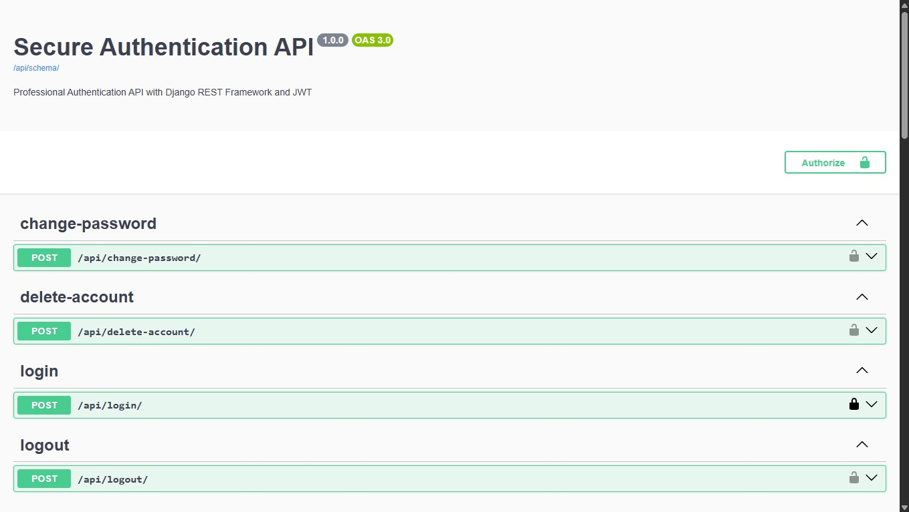
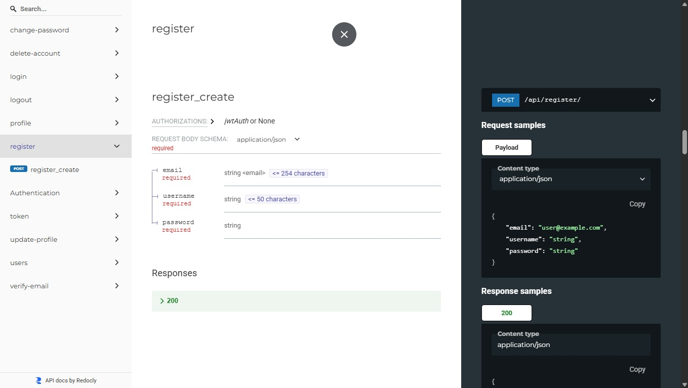

# 🔐 Secure Authentication API


API REST segura y profesional desarrollada con Django y Django REST Framework, enfocada en autenticación avanzada, autorización basada en roles y buenas prácticas de seguridad.

Diseñada como un proyecto backend profesional para demostrar conocimientos en:

  - autenticación segura
  - APIs REST
  - seguridad backend
  - manejo de usuarios
  - PostgreSQL
  - documentación de APIs
  - testing
  - despliegue en producción

### 🚀 API Online

🔗 [Abrir API](https://secure-auth-api-mvmb.onrender.com)

### 📄 Swagger Documentation

🔗 [Abrir Swagger UI](https://secure-auth-api-mvmb.onrender.com/api/docs/)



### 📘 ReDoc Documentation

🔗 [Abrir ReDoc](https://secure-auth-api-mvmb.onrender.com/api/redoc/)



## 🚀 Caracteristicas
### ​✅​ Autenticacion
- Registro de usuarios
- Login con JWT
- Logout con blascklist de tokens
- Refresh tokens
- Verificacion de email
- Reset de contraseña
- Cambio de contraseña
- Elimincacion de cuenta
- Sistema de roles (`admin`, `user`)
- Proteccion de rutas privadas

### 🔐 Seguridad
- Hash seguro de contraseñas
- Autenticación JWT con Simple JWT
- Blacklist de tokens
- Rate limiting / throttling
- Variables de entorno con `.env`
- Validación de contraseñas
- Protección de endpoints privados
- Logging de eventos de autenticación
- configuracion segura para producción
- PostgreSQL en la nube

### 👤 Gestión de usuarios
- Modelo de usuario personalizado
- Perfil de usuario autenticado
- Edición de perfil
- Búsqueda y filtrado de usuarios
- Paginación
- Roles y permisos

### 📄 Documentación
- Documentación automática con Swagger UI
- OpenAPI Schema
- ReDoc Documentation
- Testing de endpoints desde navegador

## 🛠️ Tecnologías

| Tecnología            | Uso en el proyecto                               |
| --------------------- | ------------------------------------------------ |
| Python                | Lenguaje principal del backend                   |
| Django                | Framework principal del proyecto                 |
| Django REST Framework | Construcción de la API REST                      |
| PostgreSQL            | Base de datos relacional                         |
| JWT (SimpleJWT)       | Autenticación basada en tokens                   |
| drf-spectacular       | Generación de documentación OpenAPI              |
| Swagger UI            | Documentación interactiva de la API              |
| ReDoc                 | Visualización alternativa de documentación       |
| Gunicorn              | Servidor WSGI para producción                    |
| WhiteNoise            | Manejo de archivos estáticos                     |
| SMTP Gmail            | Envío de correos electrónicos                    |
| python-decouple       | Manejo seguro de variables de entorno            |
| Render                | Despliegue y hosting en producción               |
| Django Filters        | Búsqueda y filtrado de endpoints                 |
| PostgreSQL            | Base de datos utilizada en desarrollo local      |
| Logging               | Registro de eventos de seguridad y autenticación |


##  📂 Estructura del proyecto

```bash
secure_auth_api/
│
├── accounts/
│   ├── migrations/
│   ├── tests.py
│   ├── serializers.py
│   ├── views.py
│   ├── models.py
│   ├── urls.py
│   ├── permissions.py
│   └── throttles.py
│
├── config/
│   ├── settings.py
│   ├── urls.py
│   ├── wsgi.py
│   └── asgi.py
│
├── logs/
│   └── security.log
│
├── staticfiles/
│
├── manage.py
├── requirements.txt
├── .env.example
├── .gitignore
└── README.md
```

## 🔑 Endpoints principales

| Método | Endpoint                                | Descripción            |
| ------ | --------------------------------------- | ---------------------- |
| POST   | `/api/register/`                        | Registro de usuarios   |
| POST   | `/api/login/`                           | Inicio de sesión       |
| POST   | `/api/logout/`                          | Cierre de sesión       |
| POST   | `/api/token/refresh/`                   | Renovar access token   |
| GET    | `/api/profile/`                         | Obtener perfil         |
| PATCH  | `/api/profile/update/`                  | Editar perfil          |
| POST   | `/api/change-password/`                 | Cambiar contraseña     |
| DELETE | `/api/delete-account/`                  | Eliminar cuenta        |
| POST   | `/api/request-password-reset/`          | Solicitar reset        |
| POST   | `/api/reset-password/<uidb64>/<token>/` | Restablecer contraseña |
| GET    | `/api/verify-email/<uidb64>/<token>/`   | Verificar email        |
| GET    | `/api/users/`                           | Listar usuarios        |

​

## 📄 Documentación Swagger
### Desarrollo Local
#### Swagger UI
```bash
http://127.0.0.1:8000/api/docs/
```
Schema OpenAPI
```bash
http://127.0.0.1:8000/api/schema/
```

## ⚙️ Instalación
###  Clonar repositorio
```bash
git clone https://github.com/MacG-code/secure-auth-api.git
cd secure-auth-api
pip install -r requirements.txt
```

### 🐍 Entorno virtual
#### Windows
```bash
python -m venv venv
venv\Scripts\activate
```
#### Linux/Mac
```bash
python3 -m venv venv
source venv/bin/activate
```

### 📦 Instalar dependencias
```bash
pip install -r requirements.txt
```

### ⚙️ Configurar variables de entorno
```bash
SECRET_KEY=your_secret_key

DEBUG=True

DB_NAME=secure_auth_db
DB_USER=postgres
DB_PASSWORD=your_password
DB_HOST=localhost
DB_PORT=5432

EMAIL_HOST=smtp.gmail.com
EMAIL_PORT=587
EMAIL_HOST_USER=your_email@gmail.com
EMAIL_HOST_PASSWORD=your_app_password
EMAIL_USE_TLS=True
```

### Aplicar migraciones
```bash
python manage.py makemigrations
python manage.py migrate
```

## 🧪 Testing
Test automaticos para 
 - register
 - login
 - profile 
```bash
python manage.py test
```
### Ejecutar servidor
```bash
python manage.py runserver
```
## 📈 Objetivos del Proyecto
- Aplicar buenas prácticas backend
- Implementar autenticación segura
- Fortalecer conocimientos en APIs REST
- Preparar el proyecto para producción
- Implementar seguridad profesional en APIs
- Desplegar API en la nube

### 👨‍💻 Autor
Mario Andrés Cuevas Gutiérrez

- GitHub:
https://github.com/MacG-code

- Email:
macgbros@gmail.com
## 📌 Estado del Proyecto
✅ Proyecto funcional y desplegado en producción.
